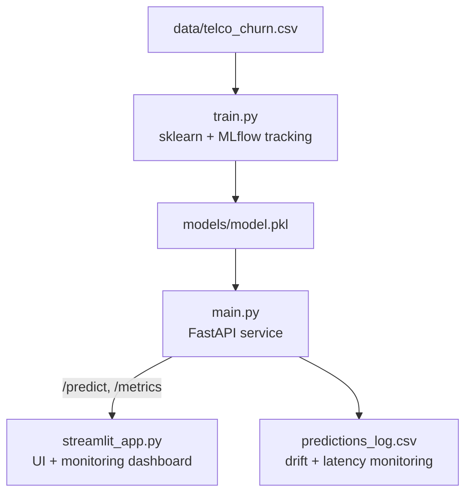

# 📉 Customer Churn Prediction — End-to-End MLOps Pipeline


Predicts whether a telecom customer will churn, using the real **IBM Telco
Customer Churn dataset** (7,043 customers). Built as a full MLOps pipeline:
model training with experiment tracking, a production-style API, and a
monitored, deployed client app.

## 🏗️ Architecture



## ✨ Features
- RandomForest classifier in a scikit-learn `Pipeline` (scaling + one-hot encoding)
- Every training run logged to **MLflow**: params, metrics, confusion matrix, registered model version
- **FastAPI** REST service with input validation (Pydantic) and interactive docs
- Live **monitoring**: prediction volume, churn rate, latency, and per-feature data drift detection
- **Streamlit** dashboard for predictions and monitoring, deployed publicly

## 📊 Model Performance

| Metric | Score |
|---|---|
| Accuracy | ~75% |
| Precision (churn) | ~52% |
| Recall (churn) | ~80% |
| F1 Score | ~63% |
| ROC-AUC | ~0.84 |

## 🛠️ Tech Stack
Python · scikit-learn · MLflow · FastAPI · Streamlit · Pandas

## 📁 Project Structure
churn-mlops/
├── data/telco_churn.csv # IBM Telco Customer Churn dataset
├── train.py # Training + MLflow tracking
├── main.py # FastAPI service
├── streamlit_app.py # Dashboard client
├── models/ # Exported model + stats
├── mlruns/, mlflow.db # MLflow tracking data
├── requirements.txt
└── README.md

## 🚀 Run Locally
```bash
pip install -r requirements.txt
python train.py                                            # train + track
mlflow ui --backend-store-uri sqlite:///mlflow.db           # view experiments
uvicorn main:app --reload                                   # serve API
streamlit run streamlit_app.py                              # run dashboard
```

## 📡 API Endpoints
| Method | Endpoint | Description |
|---|---|---|
| GET | `/health` | Health check |
| POST | `/predict` | Returns churn prediction + probability |
| GET | `/metrics` | Monitoring summary: volume, churn rate, latency, drift |